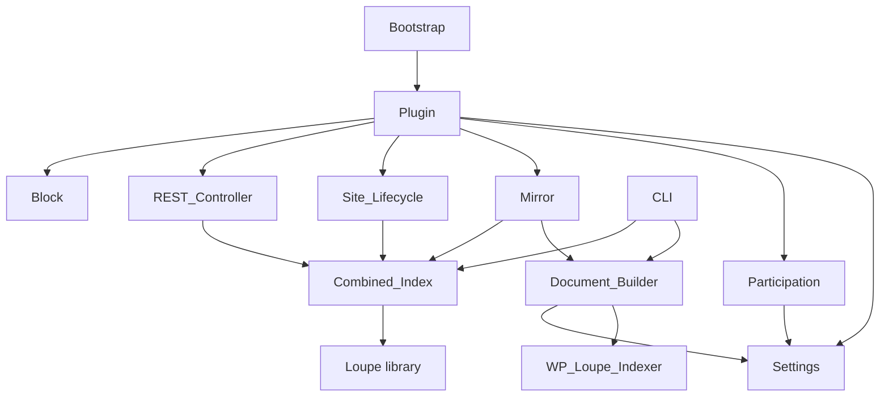

# Architecture

**Status:** current state (implemented). Version 0.1.0.

This document maps the Loupe Cross-Site Search plugin so a new developer or agent
can locate responsibilities, trace behavior, and change the system without
breaking its constraints. Domain vocabulary lives in [CONTEXT.md](../CONTEXT.md);
the "why" behind the big decisions lives in [decisions](adr/).

## 1. What the system does

On a WordPress **multisite** network, it maintains a single **combined
[Loupe](https://github.com/loupe-php/loupe) index** (SQLite) holding published
documents from many sites, and exposes one search endpoint on a designated **hub
site** so a visitor can search the whole network at once.

It is an **add-on to [Loupe Search](https://github.com/soderlind/loupe-search)**:
it reuses that plugin's document builder and depends on its bundled Loupe library.

**Non-goals (v1):** single-site installs; private/unpublished content;
cross-site deduplication; per-site custom fields in the combined index;
per-language indexes (one network language only).

## 2. External actors

| Actor | Interaction |
| --- | --- |
| Anonymous visitor | `POST/GET /wp-json/loupe-cross-site/v1/search` on the hub |
| Network admin | Configures hub, participation, language, post types |
| Content editor | Saves/trashes/deletes posts on a participating site (triggers mirroring) |
| WP-CLI operator | `wp loupe-cross-site reindex` / `verify` / `purge` |
| Loupe Search | Provides `WP_Loupe_Indexer::prepare_document()` + the Loupe engine |

## 3. Component map

All classes are in namespace `Soderlind\Plugin\LoupeCrossSiteSearch` under
[includes/](../includes) unless noted.

| Component | Responsibility | Path |
| --- | --- | --- |
| Bootstrap | Define constants, load files, boot at `plugins_loaded` (priority 20) | [loupe-cross-site-search.php](../loupe-cross-site-search.php) |
| `Plugin` | Dependency/multisite guard; wire the other components per request | [includes/class-plugin.php](../includes/class-plugin.php) |
| `Settings` | Network-option storage + Network Admin UI (hub, mode, sites, language, post types) | [includes/class-settings.php](../includes/class-settings.php) |
| `Participation` | Decide which sites participate (no `switch_to_blog`) | [includes/class-participation.php](../includes/class-participation.php) |
| `Combined_Index` | Own the Loupe instances for the combined index: config, add/delete, purge, search | [includes/class-combined-index.php](../includes/class-combined-index.php) |
| `Document_Builder` | Turn a `WP_Post` into a combined-index document (reuse + project + attribution) | [includes/class-document-builder.php](../includes/class-document-builder.php) |
| `Mirror` | Per-site lifecycle hooks that upsert/remove documents | [includes/class-mirror.php](../includes/class-mirror.php) |
| `Site_Lifecycle` | Purge a site's documents on delete/archive/spam/non-public | [includes/class-site-lifecycle.php](../includes/class-site-lifecycle.php) |
| `REST_Controller` | Hub-only search endpoint; filter-AST translation, sort/facet parsing, response shaping | [includes/class-rest-controller.php](../includes/class-rest-controller.php) |
| `CLI` | `reindex` / `verify` / `purge` (+ per-site workers) | [includes/class-cli.php](../includes/class-cli.php) |
| `Block` | Register the example search block (dynamic render) | [includes/class-block.php](../includes/class-block.php) |
| Example block assets | Editor + front-end (vanilla, pageable) | [blocks/cross-site-search/](../blocks/cross-site-search) |

### Dependency direction

`Combined_Index` is the only component that talks to the Loupe library;
`Document_Builder` is the only component that calls into Loupe Search. Nothing
depends on `REST_Controller`, `CLI`, or `Block` (they are entry points).

## 4. Boundaries

- **Network-global storage.** The combined index lives at
  `WP_CONTENT_DIR/loupe-cross-site-db/{post_type}/loupe.db`
  (`Combined_Index::base_path()`, filter `loupe_cross_site_db_path`). It is the
  same physical path for every site because `WP_CONTENT_DIR` is network-wide —
  this is what lets any site write to it without switching context.
- **Per-site write context.** Mirroring runs only inside a participating site's
  own request; documents are built with that site's live options/filters.
- **Hub-only read surface.** Routes register only when
  `Settings::get_hub_blog_id() === get_current_blog_id()`
  ([class-plugin.php](../includes/class-plugin.php)).
- **Loupe boundary.** Loupe/`prepare_document()` are invoked lazily at runtime;
  the plugin degrades (skips) rather than fatals if a site's index isn't ready.

## 5. Core flows

### 5.1 Mirror on content change (participating site)

1. Editor saves a post; `transition_post_status` fires.
2. `Mirror::on_transition()` — if the post type is covered: publish ⇒ upsert;
   leaving publish ⇒ remove. `deleted_post` ⇒ `Mirror::on_deleted()` removes.
3. `Document_Builder::build()` guards (published, not revision/autosave, not
   password-protected), reuses `WP_Loupe_Indexer::prepare_document()`, projects
   to the fixed core schema, sets id `{blog_id}_{post_id}` and `blog_id`/
   `blog_name`/`url`.
4. `Combined_Index::add_document()` / `delete_document()` writes to the per-type
   index.
5. **Failure isolation:** any exception is caught and logged in `Mirror`; the
   editor save never breaks (round-3 decision Q18).

### 5.2 Search request (hub site)

1. `POST /wp-json/loupe-cross-site/v1/search` → `REST_Controller::search_post()`.
2. Validate `q`/pagination; `parse_post_types()`; translate the JSON filter AST
   via `build_filter()` (allowlisted fields only: `post_type`, `blog_id`,
   `blog_name`, `post_date`); `parse_sort()` / `parse_facets()`.
3. `Combined_Index::search()` queries each covered per-type index, merges hits,
   sums `totalHits`, aggregates facets.
4. `format_response()` re-sorts merged hits, slices the page, and shapes hits
   (splitting `id`, adding site attribution) → `hits`, `facets`, `pagination`,
   `tookMs`.

### 5.3 Backfill (WP-CLI)

1. `wp loupe-cross-site reindex` → `CLI::reindex()` resolves participating sites.
2. For each site it launches a **separate** bootstrap:
   `WP_CLI::runcommand('loupe-cross-site reindex-site --url=<site>', ['launch' => true])`
   — native context, no `switch_to_blog` (ADR 0002).
3. The worker `CLI::reindex_site()` purges the site's slice, then rebuilds it
   from published posts via `Document_Builder::build()`.

### 5.4 Site removal / going private

1. `wp_delete_site` / `archive_blog` / `make_spam_blog` / `make_delete_blog`, or
   `update_blog_public` → 0, fires.
2. `Site_Lifecycle::purge_blog()` → `Combined_Index::purge_site()` enumerates the
   blog's docs (`ids_for_blog()`, a `blog_id` filter query) and deletes them.

## 6. Invariants

| Invariant | Where enforced | Test |
| --- | --- | --- |
| Combined-index ids are `{blog_id}_{post_id}` (no cross-site collision) | `Document_Builder::document_id()` | [DocumentBuilderTest.php](../tests/Unit/DocumentBuilderTest.php) |
| Only published, non-revision, non-password posts are indexed | `Document_Builder::build()` guards | [DocumentBuilderTest.php](../tests/Unit/DocumentBuilderTest.php) |
| Participation = public sites unless allow/block override; never archived/spam/deleted | `Participation::is_participating()` | [ParticipationTest.php](../tests/Unit/ParticipationTest.php) |
| Filter/sort/facet only on `post_type`, `blog_id`, `blog_name`, `post_date` | `REST_Controller::build_predicate()` / `parse_*()` | [RestFilterTest.php](../tests/Unit/RestFilterTest.php) |
| Settings are sanitized; post types never empty; language is a 2-letter code | `Settings::get()` | [SettingsTest.php](../tests/Unit/SettingsTest.php) |
| One network language for the whole combined index | `Combined_Index::config()` | — (ADR 0004) |

## 7. Where common changes go

| Change | Edit |
| --- | --- |
| Add an indexed/queryable field | `Combined_Index` schema consts + `Document_Builder::build()` + `REST_Controller::ALLOWED_FIELDS` |
| Change participation rules | `Participation::is_participating()` (or filter `loupe_cross_site_is_participating`) |
| Extend the search request/response | `REST_Controller` (+ `Combined_Index::search()` if new Loupe params) |
| Add a sync trigger | `Mirror` hook registration |
| Add a maintenance command | `CLI` |
| Change combined-index location | filter `loupe_cross_site_db_path` |

## 8. Decisions

- [ADR 0001](adr/0001-combined-index-over-fan-out.md) — combined index over fan-out
- [ADR 0002](adr/0002-in-context-mirroring.md) — in-context mirroring, no `switch_to_blog`
- [ADR 0003](adr/0003-own-query-write-gateway.md) — own gateway, not Loupe Search's engine
- [ADR 0004](adr/0004-single-network-language.md) — single network language

## 9. Open questions

- **Loupe browse semantics.** `Combined_Index::ids_for_blog()` and `purge_site()`
  assume an empty query with a `blog_id` filter returns all matching docs. This
  is standard Loupe behavior but is not covered by a unit test (needs a live
  Loupe engine). _Verify against the installed Loupe 1.x._
- **Cross-origin block use.** The example block on a non-hub **subdomain** site
  issues a cross-origin request to the hub; CORS may block it. Same-origin
  (hub, or subdirectory networks) works. No CORS headers are added by the plugin.
- **Write concurrency.** Writes are synchronous against one SQLite file per type;
  a busy-timeout/queue is not yet implemented (round-3 Q9 deferred).

## Verification

- Paths and symbols above were confirmed against the tree on 2026-08-08.
- Behavioral claims are backed by the tests in [tests/Unit](../tests/Unit)
  (`composer test`) and [tests/js](../tests/js) (`npm test`); the Loupe-backed
  runtime paths are the noted open question.
